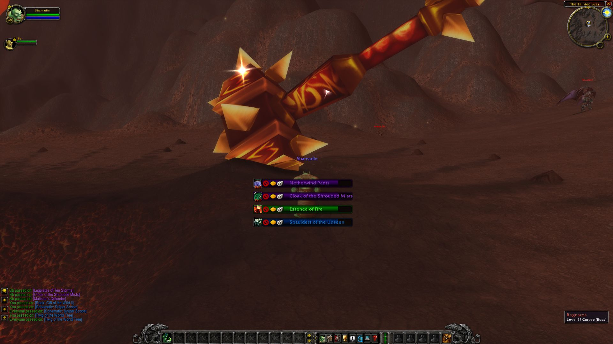

# SmallerRollFrames

This was a requested AddOn from an old friend of mine (miss you, dude). It replaces the default Roll-Frames with smaller ones and is heavily inspired by XLootGroup.

### Installation

  - [Download](https://github.com/DennisWG/SmallerRollFrames/archive/master.zip) the latest version of SmallerRollFrames directly from the repository and extract it into your `WoW/Interface/AddOns` folder.
  - Rename `SmallerRollFrames-master` to `SmallerRollFrames`
  - Run World of Warcraft and make sure to enable this addon in the character select screen
  - You can make the bottom most frame draggable by typing `/smrf toggle move` in chat
  
License
----

MIT
